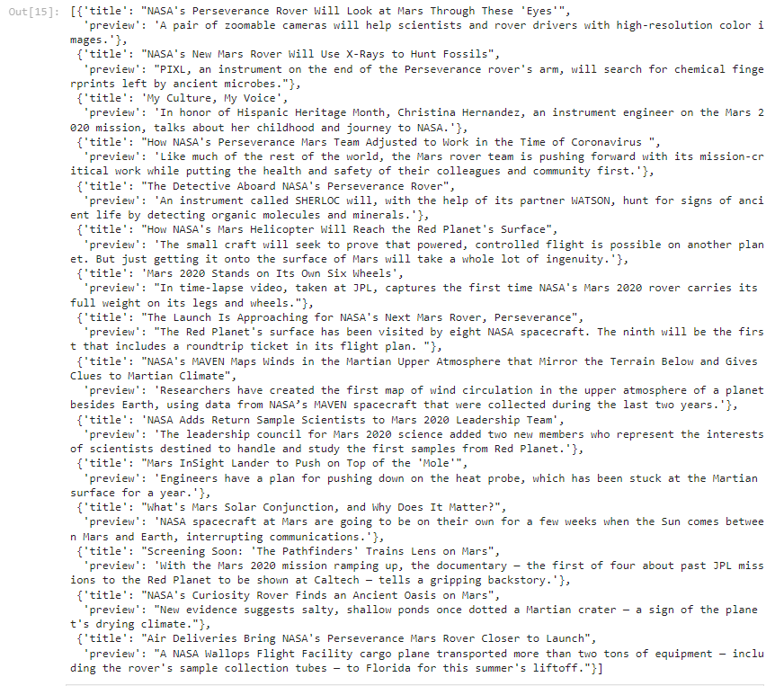

# Mars

## Overview

### Purpose
Help Robin scrape, organize, analyze, and visualize the data. Scrape titles and preview text from Mars news articles. Scrape and analyze Mars weather data, which exists in a table.

### Background
Robin is now ready to take on the full web-scraping and data analysis project for the mission to Mars. She’s learned to identify HTML elements on a page, identify their id and class attributes, and use this knowledge to extract information via both automated browsing with Splinter and HTML parsing with Beautiful Soup. She’s also learned to scrape various types of information. These include HTML tables and recurring elements, like multiple news articles on a webpage.

## Results

The list of titles and previews that were received are shown below

The data was also explored using pandas.
